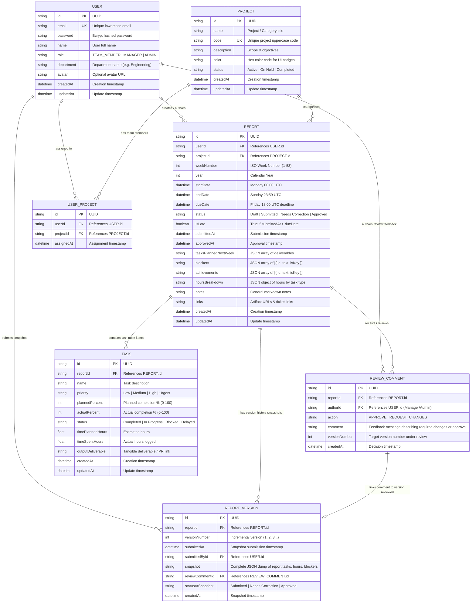

# Entity Relationship (ER) Diagram

## Overview
This document details the relational data model for the **Weekly Report Generator & Team Dashboard** application. The database architecture is built using **Prisma ORM** with native support for both **PostgreSQL** (production deployment) and **SQLite** (frictionless local evaluation).

---

## Visual ER Diagram (Mermaid)

---

## Architectural Highlights

1. **Strict Versioning & Audit Trail (`ReportVersion`)**:
   - Every time a user submits or resubmits a report, an immutable snapshot is persisted in `ReportVersion`.
   - The `reviewCommentId` foreign key links the manager's review decision directly to the specific submitted version. This allows reviewers to easily see which feedback was given against which version.

2. **Derived Statuses & Deadline Latency**:
   - `REPORT.dueDate` represents Friday 18:00 UTC. When `submittedAt > dueDate`, `isLate` is automatically set to `true`.
   - On the Manager Dashboard, team members who have not yet started a report for the active week are derived dynamically as **`Not Yet Started`**, providing complete 5-status visibility:
     `Draft`, `Submitted`, `Needs Correction`, `Approved`, `Not Yet Started`.

3. **Composite Unique Constraints**:
   - `@@unique([userId, weekNumber, year])`: Enforces that a team member can have at most one report per calendar week.
   - `@@unique([userId, projectId])`: Prevents duplicate project assignment records.
